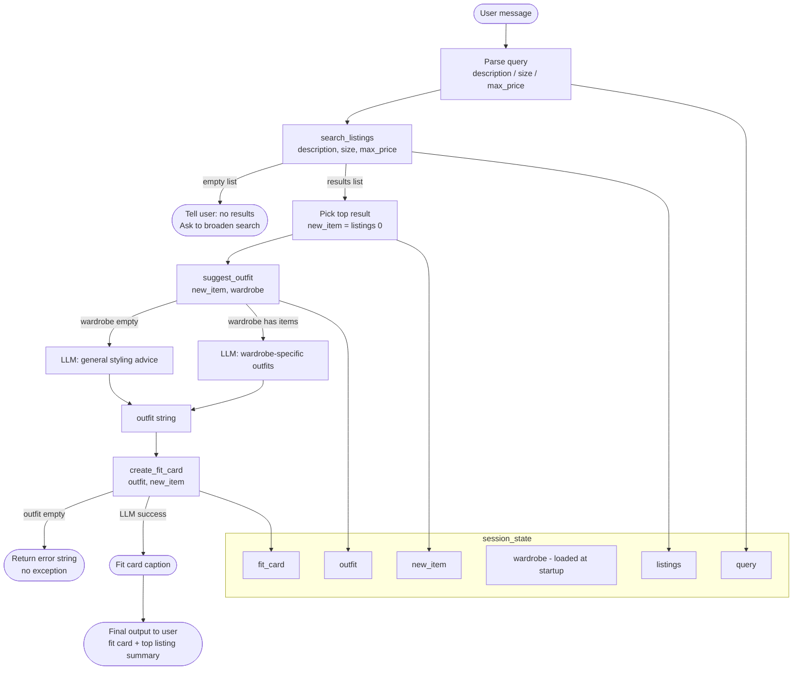

# FitFindr — planning.md

> Complete this document before writing any implementation code.
> Your spec and agent diagram are what you'll use to direct AI tools (Claude, Copilot, etc.) to generate your implementation — the more specific they are, the more useful the generated code will be.
> Your planning.md will be reviewed as part of your submission.
> Update it before starting any stretch features.

---

## Tools

List every tool your agent will use. For each tool, fill in all four fields.
You must have at least 3 tools. The three required tools are listed — add any additional tools below them.

### Tool 1: search_listings

**What it does:**
Searches the mock listings dataset (`data/listings.json`) for secondhand clothing items that match a text description, optional size, and optional price ceiling. Returns a ranked list of the best-matching listings.

**Input parameters:**
- `description` (str): Keywords describing what the user wants (e.g., "vintage graphic tee", "floral cottagecore dress"). Used to score listings by keyword overlap against each listing's `title`, `description`, `style_tags`, and `category` fields.
- `size` (str | None): Size string to filter by (e.g., `"M"`, `"W30 L30"`). Matching is case-insensitive. `None` skips size filtering.
- `max_price` (float | None): Maximum price (inclusive) in USD. `None` skips price filtering.

**What it returns:**
A list of listing dicts sorted by relevance score (highest first), or an empty list if nothing matches. Each dict contains: `id` (str), `title` (str), `description` (str), `category` (str), `style_tags` (list[str]), `size` (str), `condition` (str), `price` (float), `colors` (list[str]), `brand` (str | None), `platform` (str).

**What happens if it fails or returns nothing:**
If the list is empty, the agent tells the user no listings matched their criteria and asks them to broaden the search — for example, by relaxing the price ceiling, omitting the size filter, or trying different keywords. The agent does not proceed to `suggest_outfit` if there are no results.

---

### Tool 2: suggest_outfit

**What it does:**
Uses an LLM (via Groq) to suggest 1–2 complete outfits pairing a candidate thrifted item with pieces the user already owns. Falls back to general styling advice when the wardrobe is empty.

**Input parameters:**
- `new_item` (dict): A single listing dict returned by `search_listings` — the item the user is considering buying. Relevant fields used in the prompt: `title`, `category`, `style_tags`, `colors`, `condition`, `price`, `platform`.
- `wardrobe` (dict): A wardrobe dict with an `"items"` key containing a list of wardrobe item dicts. Each wardrobe item has: `id`, `name`, `category`, `colors` (list), `style_tags` (list), `notes` (str). May contain zero items.

**What it returns:**
A non-empty string with 1–2 outfit suggestions. If the wardrobe has items, suggestions name specific pieces from the wardrobe (e.g., "Pair it with your dark-wash baggy jeans and white canvas sneakers"). If the wardrobe is empty, returns general styling advice (what kinds of pieces complement the item's style, color, and vibe).

**What happens if it fails or returns nothing:**
If `wardrobe["items"]` is empty, the agent skips wardrobe-specific suggestions and calls the LLM with a general styling prompt instead of raising an error. If the LLM call fails (API error, timeout), the agent returns a fallback message: `"Outfit suggestions are unavailable right now, but this item is worth checking out!"` and still proceeds to `create_fit_card` with that fallback string.

---

### Tool 3: create_fit_card

**What it does:**
Uses an LLM (via Groq) to generate a short, casual outfit caption (2–4 sentences) for the thrifted find — styled like a real Instagram or TikTok OOTD post.

**Input parameters:**
- `outfit` (str): The outfit suggestion string returned by `suggest_outfit`. Used as context for the caption's vibe and styling details.
- `new_item` (dict): The listing dict for the thrifted item. Used to mention the item name, price, and platform naturally in the caption. Relevant fields: `title`, `price`, `platform`, `style_tags`, `colors`.

**What it returns:**
A 2–4 sentence string formatted as a social caption. It mentions the item name, price, and platform once each; captures the outfit vibe in specific terms; and sounds natural and casual (not like a product description). Generated at higher LLM temperature (≥0.9) so outputs vary.

**What happens if it fails or returns nothing:**
If `outfit` is empty or whitespace-only, the function returns a descriptive error string (`"Could not generate a fit card: outfit description was missing."`) without raising an exception. If the LLM call fails, return a fallback: `"Found on [platform] for $[price] — this one speaks for itself."` filled in from `new_item`.

---

### Additional Tools (if any)

No additional tools beyond the required three.

---

## Planning Loop

**How does your agent decide which tool to call next?**

The agent runs a fixed three-step linear pipeline — it does not use an LLM to choose tools dynamically. The loop proceeds as follows:

1. **Parse the user message** to extract `description`, `size` (optional), and `max_price` (optional). This is done with a simple LLM call or regex before any tool is invoked.
2. **Call `search_listings`**. If the result is an empty list, stop and ask the user to refine their query (do not proceed).
3. **Pick the top result** (index 0 of the returned list) as `new_item`. (If the user specified a preference among multiple results in a future stretch feature, this step would incorporate that choice — for now, always pick the best match.)
4. **Call `suggest_outfit`** with `new_item` and the user's wardrobe (loaded once at session start from `get_example_wardrobe()`).
5. **Call `create_fit_card`** with the outfit string and `new_item`.
6. **Return the final output** — the fit card caption plus a brief summary of the top listing — to the user. The loop is done.

The agent knows it is done after `create_fit_card` returns a non-empty string. There is no iterative re-planning.

---

## State Management

**How does information from one tool get passed to the next?**

All state is held in a single Python dict called `session_state` that lives for the duration of one agent run. It is populated step by step and passed explicitly to each tool:

```python
session_state = {
    "query": {                  # parsed from user input
        "description": str,
        "size": str | None,
        "max_price": float | None,
    },
    "listings": list[dict],     # set after search_listings() returns
    "new_item": dict,           # set to listings[0] after search step
    "wardrobe": dict,           # loaded once at startup from get_example_wardrobe()
    "outfit": str,              # set after suggest_outfit() returns
    "fit_card": str,            # set after create_fit_card() returns
}
```

`wardrobe` is the only field loaded before any tool runs. Each subsequent field is set by the tool that produces it and read by the tool that needs it. No global variables or external storage are used within a session.

---

## Error Handling

For each tool, describe the specific failure mode you're handling and what the agent does in response.

| Tool | Failure mode | Agent response |
|------|-------------|----------------|
| search_listings | No results match the query | Agent stops the pipeline, tells the user no listings matched, and prompts them to try broader keywords, a higher price, or no size filter. |
| suggest_outfit | Wardrobe is empty | Tool detects `wardrobe["items"] == []` and switches to a general styling prompt; returns general advice string instead of wardrobe-specific suggestions. Pipeline continues normally. |
| create_fit_card | Outfit input is missing or incomplete | Function checks for empty/whitespace `outfit` string and returns a descriptive error message string (no exception). If the LLM call itself fails, a template fallback string is returned using `new_item` fields. |

---

## Architecture



---

## AI Tool Plan

**Milestone 3 — Individual tool implementations:**

- **`search_listings`**: Give Claude the Tool 1 spec from this file (inputs, return value, failure mode, scoring logic) plus the `load_listings()` signature from `data_loader.py`. Ask it to implement the function using keyword overlap scoring across `title`, `description`, `style_tags`, and `category`. Verify by running 3 manual queries: (1) `"vintage graphic tee"` with no filters — expect ≥1 result with a vintage/graphic tag; (2) `"floral dress"` with `max_price=25.0` — expect all results under $25; (3) `"zxqvbnm"` — expect empty list.

- **`suggest_outfit`**: Give Claude the Tool 2 spec plus the example wardrobe structure from `wardrobe_schema.json`. Ask it to implement using the Groq client from `_get_groq_client()`. Verify with two cases: (a) pass `get_example_wardrobe()` — confirm the response names specific wardrobe pieces; (b) pass `get_empty_wardrobe()` — confirm it returns general advice and doesn't crash.

- **`create_fit_card`**: Give Claude the Tool 3 spec including the caption style guidelines (casual, mentions item name/price/platform once each, higher temperature). Ask it to implement using Groq. Verify by calling it with a real listing dict and a sample outfit string — confirm the caption is 2–4 sentences, feels natural, and includes the platform name. Also test with `outfit=""` to confirm it returns an error string rather than raising.

**Milestone 4 — Planning loop and state management:**

- Give Claude the Planning Loop section, the State Management section, and the Architecture diagram from this file. Ask it to implement an `agent.py` with a `run_agent(user_message, wardrobe)` function that populates `session_state` step by step and calls each tool in order. Verify by running the complete example query from the "A Complete Interaction" section below end-to-end and confirming (1) the top listing is relevant, (2) the outfit mentions wardrobe pieces, (3) the fit card is a plausible caption. Also test the empty-results branch by passing a nonsense description.

---

## A Complete Interaction (Step by Step)

**Example user query:** "I'm looking for a vintage graphic tee under $30. I mostly wear baggy jeans and chunky sneakers. What's out there and how would I style it?"

**Step 1:**
The agent parses the user message and extracts: `description = "vintage graphic tee"`, `size = None` (not specified), `max_price = 30.0`. It calls `search_listings("vintage graphic tee", size=None, max_price=30.0)`. The function loads all 40 listings, filters to those priced ≤ $30, scores each by keyword overlap with "vintage graphic tee" across title/description/style_tags/category, drops zero-score listings, and returns a sorted list. Suppose 3 listings match — e.g., a worn-in band tee ($18, depop), a Y2K butterfly graphic tee ($24, poshmark), and a faded 90s skateboard tee ($27, thredUp).

**Step 2:**
`search_listings` returned 3 results. The agent picks `new_item = listings[0]` — the top-scored result, the band tee (`id: "lst_017"`, title: `"Worn-In Band Tee — Black"`, price: 18.0, platform: `"depop"`, style_tags: `["vintage", "grunge", "graphic"]`). It calls `suggest_outfit(new_item, wardrobe)` where `wardrobe` is the pre-loaded example wardrobe (10 items including baggy dark-wash jeans, white canvas sneakers, and an oversized denim jacket). The LLM receives a prompt describing the band tee and listing the wardrobe pieces, and returns: *"Pair the band tee with your baggy dark-wash jeans and white canvas sneakers for an easy off-duty grunge look. Layer the oversized denim jacket on top for cooler days — roll the sleeves and leave it open."*

**Step 3:**
`suggest_outfit` returned the outfit string above. The agent calls `create_fit_card(outfit, new_item)` with that string and the band tee listing dict. The LLM receives a prompt with the item details and outfit description and is asked for a 2–4 sentence Instagram caption at temperature 0.9. It returns something like: *"thrifted this worn-in band tee off depop for $18 and it's already the hardest thing in my closet 🖤 baggy jeans + canvas sneakers + oversized denim jacket = the only fit formula i need. vintage grunge for under $20, make it make sense."*

**Final output to user:**
The agent presents the fit card caption above, followed by a brief listing summary: the top match's title, price, condition, and platform link context. The user sees something like:

> **Top find:** Worn-In Band Tee — Black · $18 · Good condition · depop
>
> **Outfit idea:** Pair the band tee with your baggy dark-wash jeans and white canvas sneakers for an easy off-duty grunge look. Layer the oversized denim jacket on top for cooler days — roll the sleeves and leave it open.
>
> **Fit card:** thrifted this worn-in band tee off depop for $18 and it's already the hardest thing in my closet 🖤 baggy jeans + canvas sneakers + oversized denim jacket = the only fit formula i need. vintage grunge for under $20, make it make sense.
